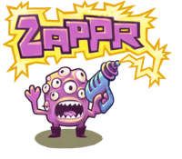

**Approval checks for GitHub pull requests.**

[](https://travis-ci.org/zalando/zappr)
[](https://codeclimate.com/github/zalando/zappr)
[](https://david-dm.org/zalando/zappr)
[](https://gitter.im/zalando/zappr)

Zappr is a GitHub integration built to enhance your project workflow. Built by open-source enthusiasts,
it's aimed at helping developers to increase productivity and improve open-source project quality.
It does this primarily by removing bottlenecks around pull request approval and helping project owners to
halt "rogue" pull requests before they're merged into the master branch.

### Setup, FAQ and further information

Please refer to [our documentation](https://zappr.readthedocs.org/).

### Development

Zappr needs a database during development and testing. For this reason there's a `docker-compose.yaml` 
for your convenience, with which you can either start a database for development (`postgres-dev`):

~~~ shell
# starts postgres docker container
docker-compose up postgres-dev
# creates database and schemas, only needed first time
./init_db.sh
export DB_HOST="$(docker-machine ip)"
npm run all
~~~

If you would like to run a complete Zappr locally, you can do it like this:

1. Export your [Github credentials](https://github.com/settings/applications) and docker-machine IP:
https://auth0.com/docs/connections/social/github
~~~ shell
export DM_IP="$(docker-machine ip)"
export GITHUB_CLIENT_ID=<your-client-id>
export GITHUB_CLIENT_SECRET=<your-client-secret>
~~~

2. Start Zappr via docker compose or npm
~~~ shell
docker-compose up
~~~

~~~ shell
npm install
npm run build
npm run all
~~~

3. Install and run localtunnel to expose your localhost
~~~ shell
npm i -g localtunnel
lt -s myzappr -p 3000
~~~

4. Set your OAuth application URLs to `https://myzappr.localtunnel.me` in the GitHub settings

5. Go to `https://myzappr.localtunnel.me` and do things :)

**Debug Client and Server:**

```
npm run build
npm run all
```

Enable debug logs...

...in the terminal:

```
export DEBUG="zappr:*"
```

...in the browser console:

```
window.DEBUG.enable('zappr:*')
```

**Test:**

First start the testing database:

~~~ shell
export DB_HOST="$(docker-machine ip)"
docker-compose up postgres-test
# creates database and schemas, only needed first time
./init_db.sh
~~~

Then you can do:

* `npm test` - run combined tests
* `npm run test-client` - run only client tests
* `npm run test-server` - run only server tests
* `npm run test-karma` - run Karma (UI) tests

**Docker Image:**

1. Check out `master` and clean up your `git status`
2. Run the build script:

        ./tools/build.sh (<tag>)

* `NPM_BUILD_INSIDE_CONTAINER` "true" to build inside a container
* `DOCKER_ARTIFACT_FILE` file to store docker artifact name in


## Contributing to Zappr
Please read our [contributor guidelines](https://github.com/zalando/zappr/blob/master/CONTRIBUTING.md) for more details.
And please check [these open issues](https://github.com/zalando/zappr/issues) for specific tasks.

## License

The MIT License (MIT)

Copyright (c) 2016 Zalando SE

Permission is hereby granted, free of charge, to any person obtaining a copy
of this software and associated documentation files (the "Software"), to deal
in the Software without restriction, including without limitation the rights
to use, copy, modify, merge, publish, distribute, sublicense, and/or sell
copies of the Software, and to permit persons to whom the Software is
furnished to do so, subject to the following conditions:

The above copyright notice and this permission notice shall be included in all
copies or substantial portions of the Software.

THE SOFTWARE IS PROVIDED "AS IS", WITHOUT WARRANTY OF ANY KIND, EXPRESS OR
IMPLIED, INCLUDING BUT NOT LIMITED TO THE WARRANTIES OF MERCHANTABILITY,
FITNESS FOR A PARTICULAR PURPOSE AND NONINFRINGEMENT. IN NO EVENT SHALL THE
AUTHORS OR COPYRIGHT HOLDERS BE LIABLE FOR ANY CLAIM, DAMAGES OR OTHER
LIABILITY, WHETHER IN AN ACTION OF CONTRACT, TORT OR OTHERWISE, ARISING FROM,
OUT OF OR IN CONNECTION WITH THE SOFTWARE OR THE USE OR OTHER DEALINGS IN THE
SOFTWARE.
