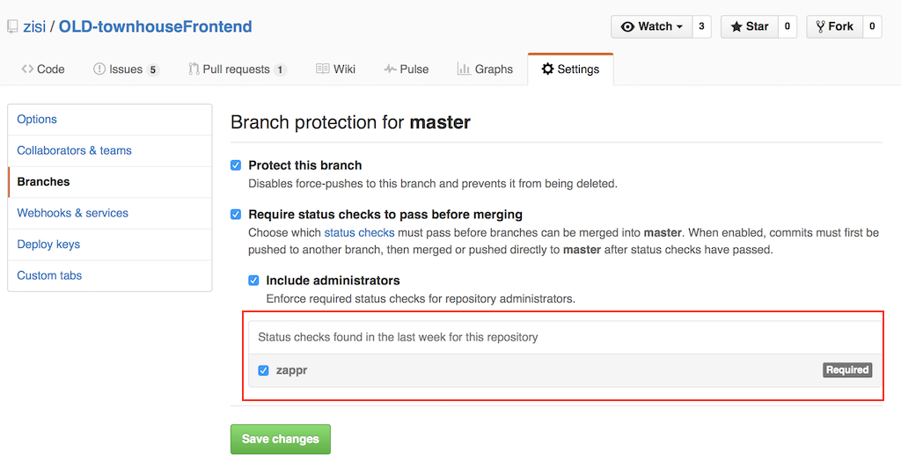

# Set up Zappr

Using your GitHub account, sign in to Zappr [here](https://zappr.opensource.zalan.do/login).

Authorize Zappr. We outline why we need certain scopes in our [FAQ](https://zappr.readthedocs.org/en/latest/faq).

Once you're back at Zappr you will see all repositories that we know listed on the left. Initially we only fetch the first couple of repositories, so if you don't find the one you're looking for please click the blue "Sync with Github" button. It will then load all the repositories, which might take a couple of seconds. Also use this button if you want to enable Zappr for repositories that are new in your account.

To enable Zappr features on a specific repository, select a it from the list and switch the toggle to "On".

See below how to customize Zappr to your needs.

## Zappr features and their configuration options

You can customize Zappr by adding a [`.zappr.yaml`](https://github.com/zalando/zappr/blob/master/.zappr-example.yaml) file to your repository (top-level), similar to Travis. It [takes](https://github.com/zalando/zappr/blob/master/.zappr-example.yaml) a couple of different options. We keep an [example configuration file](https://github.com/zalando/zappr/blob/master/.zappr-example.yaml) in our repository.

### Approvals

The approval feature blocks a pull request until it has the required amount of approvals (essentialy people confirming that the changes are good to merge).
In order to achieve it [protected branches](https://github.com/blog/2051- aprotected-branches-and-required-status-checks) should be enabled and "zappr" check should be selected:

It is customized by everything under `approvals`. The following options are supported:

* `minimum`: How many approvals a pull request needs before it is considered mergable. Defaults to 2.
* `pattern`: Since approvals are essentially comments that match a pattern, you can configure the pattern! It's a string that will be passed to Javascript's `RegExp` constructor and defaults to `^(:+1:|👍)$`. (Tip: If you're not sure about your regex, [regex101.com](https://regex101.com/) is great to test it.)
* `from`: By default any comment that matches the pattern is considered an approval, regardless of the author. You can change this by
** organization: list organizations under `orgs` that the author has to be a public member of
** usernames: list usernames under `users`
** collaborators: set the `collaborators` flag to `true`

~~~ yaml
# just an example how to configure it
approvals:
  pattern: "^(:\\+1:|👍)" # must start with thumbs up
  minimum: 2 # at least two approvals from other people necessary
  from: # has to be either one of the following
    orgs:
      - zalando
    collaborators: true
    usernames:
      - prayerslayer
      - mfellner
~~~

### Autobranch

The automatic branch creation feature creates a branch in you repository for every ticket that is opened, so you don't have to.

It is customized by putting configuration under `autobranch`. The following options are supported:

* `pattern`: How the branch name is generated. It is a template string where you can use the variables `{number}`, `{title}` and `{labels}`. Defaults to `{number}-{title}`.
* `length`: Maximum length of the branch name, will be cut off. Defaults to 60 characters.

~~~ yaml
# example configuration
autobranch:
  pattern: {number}-{title}
  length: 60
~~~

### Commit Messages

The commit message feature lets you verify that all commit messages in a pull request match a pattern. The primary use case for this is to have all commits mention the ticket number.

It is configured by putting configuration under `commit.message` and supports the following options:

* `patterns`: Which regexes to check the commit messages against. Always also matches `^#[0-9]+` (default). Matching is done by logical OR concatenation, ie. messages have to match any one of the provided patterns.

~~~ yaml
# example configuration
commit:
  message:
    patterns: # commit message has to match any one of
      - "^#[0-9]+" # starts with hash and digits
      - "^[A-Z]+-[0-9]+" # starts with uppercase letters, a dash and digits
~~~
