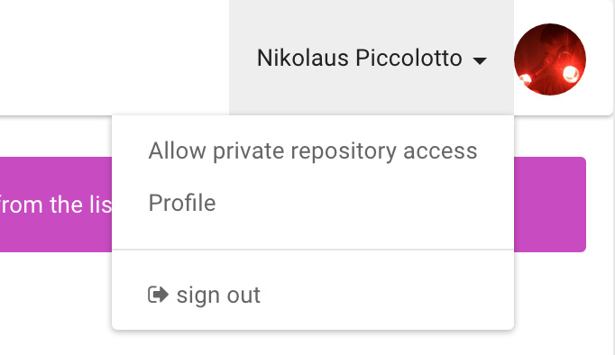

# Set up Zappr

Using your GitHub account, sign in to Zappr [here](https://zappr.opensource.zalan.do/login).

Authorize Zappr. We outline why we need certain scopes in our [FAQ](https://zappr.readthedocs.org/en/latest/faq).

Once you're back at Zappr you will see all _public_ repositories that we know listed on the left. If you also want to trust us with your _private_ repositories, you can do that:

<strong>Note:</strong> Be aware that once you gave Zappr permission to read your private repositories, the only way to <strong>really</strong> revoke it is by revoking access for Zappr <a href="https://github.com/settings/applications">here</a>. (When you accepted a scope once, Github will never ask you again about it.) We promise not to do sneaky things, but you should act according to your paranoia level.

However be also aware that once you revoked access for Zappr, you effectively broke all checks that you enabled, because the stored access tokens were invalidated.

Initially we only fetch the first couple of repositories, so if you don't find the one you're looking for please click the blue "Sync with Github" button. It will then load all the repositories, which might take a couple of seconds. Also use this button every time you want to udpate your repository list, e.g. after renamings, deletions or when you created new repositories.

To enable Zappr features on a specific repository, select a it from the list and switch the toggle to "On". If this repository does not contain a `.zappr.yaml` yet, we will create a pull request with some possible configuration options (not exhaustive). Also Zappr will automatically [protect](https://github.com/blog/2051-protected-branches-and-required-status-checks) the default branch of your repository (usually `master`) and set the feature you enabled as a required status check.

<strong>Note:</strong> You have to have admin access to a repository to enable Zappr features for it.

See below how to customize Zappr to your needs.

## Zappr features and their configuration options

You can customize Zappr by adding a [`.zappr.yaml`](https://github.com/zalando/zappr/blob/master/.zappr-example.yaml) file to your repository (top-level), similar to Travis. It [takes](https://github.com/zalando/zappr/blob/master/.zappr-example.yaml) a couple of different options. We keep an [example configuration file](https://github.com/zalando/zappr/blob/master/.zappr-example.yaml) in our repository.

### Approvals

The approval feature blocks a pull request  until it has the required amount of approvals (essentially people confirming that the changes are good to merge).

It is customized by everything under `approvals`. The following options are supported:

* `minimum`: How many approvals a pull request needs before it is considered mergable. Defaults to 2.
* `ignore`: Whether Zappr should ignore approvals by the `last_committer` on the pull request, the `pr_opener`, `both` or `none`. Defaults to `none`.
* `pattern`: Since approvals are essentially comments that match a pattern, you can configure the pattern! It's a string that will be passed to Javascript's `RegExp` constructor and defaults to `^(:+1:|👍)$`. (Tip: If you're not sure about your regex, [regex101.com](https://regex101.com/) is great to test it.)
* `from`: By default any comment that matches the pattern is considered an approval, regardless of the author. You can change this by
  * `organization`: list organizations under `orgs` that the author has to be a public member of
  * `usernames`: list usernames under `users`
  * `collaborators`: set the `collaborators` flag to `true`
* `groups`: If there are sets of people you absolutely want to approve every pull request in your project, you can define groups and set a `minimum` amount of approvals required by its members. Use a `from` clause (see above) to specify who's a member and who isn't.

~~~ yaml
# just an example how to configure it
approvals:
  pattern: "^(:\\+1:|👍)" # must start with thumbs up
  minimum: 2 # at least two approvals from other people necessary
  ignore: pr_opener # do not count approval from PR opener
  from: # has to be either one of the following
    orgs:
      - zalando
    collaborators: true
    users:
      - prayerslayer
      - mfellner
  groups:
    # mfellner is required approver on every PR
    seniors:
      minimum: 1
      from:
        users:
          - mfellner
~~~

Since approvals from `group` members are counted against the total amount of approvals as well you can omit the `from` clause if you only have groups.

~~~ yaml
approvals:
  # check will succeed if there are 4 approvals from
  # backend or frontend people
  minimum: 4
  groups:
    # check will fail if there is not at least 1 approval
    # from backend persons
    backend:
      minimum: 1
      from:
        users:
          - backendperson1
          - backendperson2
          - backendperson3
    # check will fail if there is not at least 1 approval
    # from frontend persons
    frontend:
      minimum: 1
      from:
        users:
          - frontendperson1
          - frontendperson2
          - frontendperson3
~~~

### Autobranch

The automatic branch creation feature creates a branch in you repository for every ticket that is opened, so you don't have to.

It is customized by putting configuration under `autobranch`. The following options are supported:

* `pattern`: How the branch name is generated. It is a template string where you can use the variables `{number}`, `{title}` and `{labels}`. Defaults to `{number}-{title}`.
* `length`: Maximum length of the branch name, will be cut off. Defaults to 60 characters.

~~~ yaml
# example configuration
autobranch:
  pattern: {number}-{title}
  length: 60
~~~

### Commit Messages

The commit message feature lets you verify that all commit messages in a pull request match a pattern. The primary use case for this is to have all commits mention the ticket number.

It is configured by putting configuration under `commit.message` and supports the following options:

* `patterns`: Which regexes to check the commit messages against. Always also matches `^#[0-9]+` (default). Matching is done by logical OR concatenation, ie. messages have to match any one of the provided patterns.

~~~ yaml
# example configuration
commit:
  message:
    patterns: # commit message has to match any one of
      - "^#[0-9]+" # starts with hash and digits
      - "^[A-Z]+-[0-9]+" # starts with uppercase letters, a dash and digits
~~~

### Specification

The specification check lets you verify that proper specification was provided along with a pull request. This is based on heuristics you define. Please take the default values from the YAML snippet below.

It is configured by putting your config under `specification` and supports the following options:

~~~ yaml
specification:
  # title requirements AND body AND template requirements have to match
  title:
    # PR title is at least this many characters long
    minimum-length:
      enabled: true
      length: 8
  body:
    # either of these verifications has to be true
    # PR body is at least this many characters long
    minimum-length:
      enabled: true
      length: 8
    # contains a link
    contains-url: true
    # contains an issue number
    contains-issue-number: true
   template:
     # is different from pull request body
     differs-from-body: true
~~~

### Pull Request Labels

With the Pull Request Labels check you can block a pull request until it has the required set of labels. For instance you could use a label `WIP` to mark work in progress (and block merges) together with a label `reviewed` indicate that review is finished (and the pull request can be merged).

It is configured under `pull-request.labels` and supports two options:

~~~ yaml
pull-request:
  labels:
    # pull request cannot be merged without these labels
    required:
      - reviewed
    # allow additional labels to be present. true is the default..
    additional: true
~~~

### Pull Request Tasks

This check blocks pull requests that have open tasks. E.g. a pull request with this description:

~~~
Fixes #1

Needs to be done:

- [ ] Write tests
~~~

Would be blocked until it reads like this:

~~~
Fixes #1

Needs to be done:

- [x] Write tests
~~~

Currently this check doesn't take configuration.
