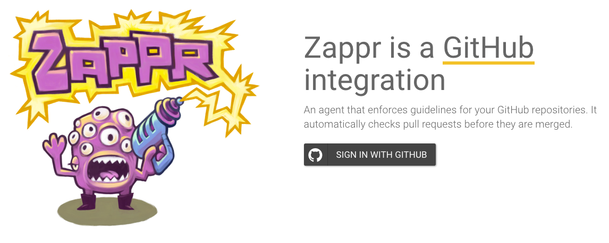
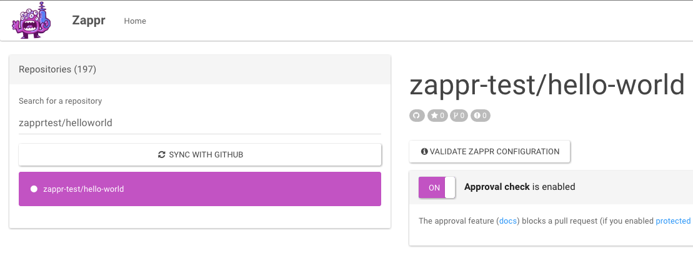

# Set up Zappr

Using your GitHub account, sign in to Zappr [here](https://zappr.opensource.zalan.do/login).

Authorize Zappr. We outline why we need certain scopes in our [FAQ](https://zappr.readthedocs.org/en/latest/faq).

Once you're back at Zappr you will see all repositories that we know listed on the left. Initially we only fetch the first couple of repositories, so if you don't find the one you're looking for please click the blue "Sync with Github" button. It will then load all the repositories, which might take a couple of seconds. Also use this button if you want to enable Zappr for repositories that are new in your account.

To enable Zappr features on a specific repository, select a it from the list and switch the toggle to "On".

See below how to customize Zappr to your needs.

## Zappr configuration options

You can customize Zappr by adding a [`.zappr.yml`](https://github.com/zalando/zappr/blob/master/.zappr-example.yml) file to your repository (top-level), similar to Travis. It [takes](https://github.com/zalando/zappr/blob/master/.zappr-example.yml) a couple of different options. We keep an [example configuration file](https://github.com/zalando/zappr/blob/master/.zappr-example.yml) in our repository.

### Approvals

The approval feature is customized by everything under `approvals`. The following options are supported:

* `minimum`: How many approvals a pull request needs before it is considered mergable. Defaults to 2.
* `pattern`: Since approvals are essentially comments that match a pattern, you can configure the pattern! It's a string that will be passed to Javascript's `RegExp` constructor and defaults to `:+1:`. (Tip: If you're not sure about your regex, [regex101.com](https://regex101.com/) is great to test it.)
* `from`: By default any comment that matches the pattern is considered an approval, regardless of the author. You can change this by
** organization: list organizations under `orgs` that the author has to be a public member of
** usernames: list usernames under `users`
** collaborators: set the `collaborators` flag to `true`

### Autobranch

The automatic branch creation feature is customized by putting configuration under `autobranch`. The following options are supported:

* `pattern`: How the branch name is generated. It is a template string where you can use the variables `{number}`, `{title}` and `{labels}`. Defaults to `{number}-{title}`.
* `length`: Maximum length of the branch name, will be cut off. Defaults to 60 characters.